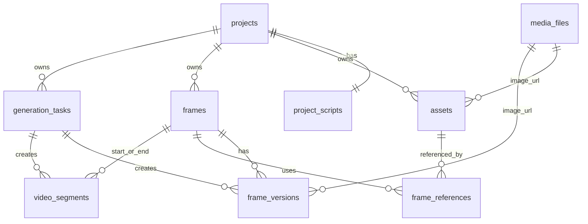

# 表结构设计

这是图片关键帧生成工作台的 MVP 数据模型。设计目标不是把页面上的每个区域都变成一张表，而是围绕创作链路拆分：

项目 -> 剧本 -> 资产 -> 关键帧 -> 帧图片版本 -> 生成任务 -> 后续视频片段

## 设计原则

- 项目只保存项目级配置，比如名称、描述、宽高比。
- 剧本在 MVP 里一个项目只保留一份正文，不做复杂分场表。
- 资产库统一管理角色、场景、道具、其他素材，图片存在火山 TOS 桶里，数据库只记录文件链接。
- 关键帧记录故事信息和时长，是后续视频节奏的核心表。
- 帧版本记录每次生成出的图片，一帧可以有多个版本，当前选中版本挂在 `frames.selected_version_id`。
- 生成任务统一记录图片、图片编辑、视频等模型调用，方便排队、重试和审计；模型选择由后端配置决定，前端不暴露模型切换。
- 视频相关先预留最小表，不和图片帧工作台搅在一起。

## MySQL 约定

- 数据库使用 MySQL 8.x，字符集统一 `utf8mb4`。
- UUID 使用 `char(36)` 保存，由应用层生成。
- JSON 字段使用 MySQL `json` 类型，默认 `{}` 或 `[]` 由应用层写入。
- 时间字段使用 `datetime(6)`，更新时间字段加 `on update current_timestamp(6)`。
- 外键统一使用 InnoDB。

## ER 关系



## MVP 表

### projects

项目列表和项目设置。

```sql
create table projects (
  id char(36) primary key,
  name varchar(120) not null,
  description text not null,
  aspect_ratio varchar(20) not null default '16:9',
  status varchar(20) not null default 'active',
  created_at datetime(6) not null default current_timestamp(6),
  updated_at datetime(6) not null default current_timestamp(6) on update current_timestamp(6)
) engine=InnoDB default charset=utf8mb4 collate=utf8mb4_unicode_ci;

create index idx_projects_created_at on projects (created_at desc);
```

### project_scripts

一个项目一份剧本文本。先别急着拆“场次/镜头”，现在拆了只会增加录入负担。

```sql
create table project_scripts (
  id char(36) primary key,
  project_id char(36) not null unique,
  content text not null,
  created_at datetime(6) not null default current_timestamp(6),
  updated_at datetime(6) not null default current_timestamp(6) on update current_timestamp(6),
  constraint fk_project_scripts_project
    foreign key (project_id) references projects(id) on delete cascade
) engine=InnoDB default charset=utf8mb4 collate=utf8mb4_unicode_ci;
```

### media_files

统一保存上传图、资产图、帧图、后续视频文件。文件本体放火山 TOS 桶，业务表只挂文件链接，不存 base64。

```sql
create table media_files (
  id char(36) primary key,
  project_id char(36),
  file_type varchar(20) not null,
  url text not null,
  mime_type varchar(120),
  width int,
  height int,
  duration_ms int,
  size_bytes bigint,
  metadata json not null,
  created_at datetime(6) not null default current_timestamp(6),
  constraint chk_media_files_type
    check (file_type in ('image', 'video', 'audio', 'other')),
  constraint fk_media_files_project
    foreign key (project_id) references projects(id) on delete cascade
) engine=InnoDB default charset=utf8mb4 collate=utf8mb4_unicode_ci;

create index idx_media_files_project on media_files (project_id, created_at desc);
```

### assets

资产库：角色、场景、道具、其他。资产可以先没有图片，点“新建资产”后再替换图片。

```sql
create table assets (
  id char(36) primary key,
  project_id char(36) not null,
  type varchar(20) not null,
  name varchar(120) not null,
  description text not null,
  default_prompt text not null,
  tags json not null,
  image_file_id char(36),
  sort_order int not null default 0,
  created_at datetime(6) not null default current_timestamp(6),
  updated_at datetime(6) not null default current_timestamp(6) on update current_timestamp(6),
  constraint chk_assets_type
    check (type in ('role', 'scene', 'prop', 'other')),
  constraint fk_assets_project
    foreign key (project_id) references projects(id) on delete cascade,
  constraint fk_assets_image_file
    foreign key (image_file_id) references media_files(id) on delete set null
) engine=InnoDB default charset=utf8mb4 collate=utf8mb4_unicode_ci;

create index idx_assets_project_type on assets (project_id, type, sort_order, created_at desc);
```

### public_assets

公共资产库：保存可跨项目复用的角色、场景、道具、怪物、载具等资产模板。公共资产不属于任何项目，导入项目时必须复制成项目自己的 `assets` 和 `media_files` 记录。

`image_file_id` 只表示公共资产的主图，用于列表封面和默认引用图。一个公共资产可以通过 `public_asset_images` 拥有多张图集图片，例如角色正面、侧面、背面、表情、动作姿势、不同场景测试图。

```sql
create table public_assets (
  id char(36) primary key,
  type varchar(20) not null,
  name varchar(120) not null,
  description text not null,
  default_prompt text not null,
  tags json not null,
  image_file_id char(36),
  sort_order int not null default 0,
  status varchar(20) not null default 'active',
  created_at datetime(6) not null default current_timestamp(6),
  updated_at datetime(6) not null default current_timestamp(6) on update current_timestamp(6),
  constraint chk_public_assets_type
    check (type in ('role', 'character', 'scene', 'prop', 'monster', 'vehicle', 'other', '角色', '场景', '道具', '怪物', '载具', '其他')),
  constraint chk_public_assets_status
    check (status in ('active', 'archived')),
  constraint fk_public_assets_image_file
    foreign key (image_file_id) references media_files(id) on delete set null
) engine=InnoDB default charset=utf8mb4 collate=utf8mb4_unicode_ci;

create index idx_public_assets_type on public_assets (type, sort_order, created_at desc);
create index idx_public_assets_status on public_assets (status, created_at desc);
```

### public_asset_images

公共资产图集：保存同一个公共资产在不同角度、不同构图、不同场景下的参考图。角色资产至少建议包含主图、正面、左 45 度、右 45 度、侧面、背面、表情、动作、场景测试图。

`media_file_id` 指向公共媒体文件。导入到项目时，图集图片也应按需复制到项目媒体记录；第一阶段可以只复制主图，后续导入弹窗允许用户勾选“导入图集”。

```sql
create table public_asset_images (
  id char(36) primary key,
  public_asset_id char(36) not null,
  media_file_id char(36) not null,
  role varchar(40) not null default 'reference',
  title varchar(120) not null default '',
  description text not null,
  prompt text not null,
  scene_prompt text not null,
  angle varchar(40) not null default '',
  tags json not null,
  is_primary boolean not null default false,
  sort_order int not null default 0,
  created_at datetime(6) not null default current_timestamp(6),
  updated_at datetime(6) not null default current_timestamp(6) on update current_timestamp(6),
  constraint chk_public_asset_images_role
    check (role in ('primary', 'front', 'left_45', 'right_45', 'side', 'back', 'expression', 'pose', 'scene', 'reference', 'other')),
  constraint fk_public_asset_images_asset
    foreign key (public_asset_id) references public_assets(id) on delete cascade,
  constraint fk_public_asset_images_media
    foreign key (media_file_id) references media_files(id) on delete cascade
) engine=InnoDB default charset=utf8mb4 collate=utf8mb4_unicode_ci;

create index idx_public_asset_images_asset on public_asset_images (public_asset_id, sort_order, created_at);
create index idx_public_asset_images_role on public_asset_images (public_asset_id, role, sort_order);
```

图集字段约定：

| 字段 | 用途 |
| --- | --- |
| `role` | 图片用途，如主图、正面、侧面、背面、表情、动作、场景测试 |
| `title` | 展示名，例如“正面全身”“雨夜街道测试” |
| `description` | 这张图的可读说明 |
| `prompt` | 生成这张图时使用的角色/资产提示词 |
| `scene_prompt` | 如果是场景测试图，记录场景或镜头提示词 |
| `angle` | 角度信息，例如 `front`、`left_45`、`back` |
| `is_primary` | 是否为主图；同一资产建议只有一张主图，同时同步到 `public_assets.image_file_id` |

### frames

关键帧时间轴。这里要保存“这一帧讲什么”和“这一帧持续多久”。

```sql
create table frames (
  id char(36) primary key,
  project_id char(36) not null,
  order_index int not null,
  summary text not null,
  duration_ms int not null default 3000,
  people text not null,
  dialogue text not null,
  action text not null,
  emotion text not null,
  note text not null,
  current_prompt text not null,
  selected_version_id char(36),
  created_at datetime(6) not null default current_timestamp(6),
  updated_at datetime(6) not null default current_timestamp(6) on update current_timestamp(6),
  unique key uq_frames_project_order (project_id, order_index),
  constraint fk_frames_project
    foreign key (project_id) references projects(id) on delete cascade
) engine=InnoDB default charset=utf8mb4 collate=utf8mb4_unicode_ci;

create index idx_frames_project_order on frames (project_id, order_index);
```

### frame_versions

一帧可以生成多张图，版本表保存每次结果。不要覆盖旧图，否则用户没法做 v1/v2 切换。

```sql
create table frame_versions (
  id char(36) primary key,
  frame_id char(36) not null,
  version_no int not null,
  image_file_id char(36),
  prompt text not null,
  model_provider varchar(80) not null,
  model_name varchar(120) not null,
  generation_task_id char(36),
  metadata json not null,
  created_at datetime(6) not null default current_timestamp(6),
  unique key uq_frame_versions_frame_version (frame_id, version_no),
  constraint fk_frame_versions_frame
    foreign key (frame_id) references frames(id) on delete cascade,
  constraint fk_frame_versions_image_file
    foreign key (image_file_id) references media_files(id) on delete set null
) engine=InnoDB default charset=utf8mb4 collate=utf8mb4_unicode_ci;

create index idx_frame_versions_frame on frame_versions (frame_id, version_no);
```

给 `frames.selected_version_id` 补外键，避免建表时互相依赖：

```sql
alter table frames
  add constraint fk_frames_selected_version
  foreign key (selected_version_id)
  references frame_versions(id)
  on delete set null;
```

### frame_references

记录某一帧生成时引用了哪些资产或项目帧。这个表很重要，否则以后追溯“这张图为什么长这样”会很痛苦。

```sql
create table frame_references (
  id char(36) primary key,
  frame_id char(36) not null,
  ref_type varchar(20) not null,
  asset_id char(36),
  ref_frame_id char(36),
  role varchar(40) not null default 'reference',
  sort_order int not null default 0,
  created_at datetime(6) not null default current_timestamp(6),
  constraint chk_frame_references_type
    check (ref_type in ('asset', 'frame')),
  constraint chk_frame_references_target check (
    (ref_type = 'asset' and asset_id is not null and ref_frame_id is null)
    or
    (ref_type = 'frame' and ref_frame_id is not null and asset_id is null)
  ),
  constraint fk_frame_references_frame
    foreign key (frame_id) references frames(id) on delete cascade,
  constraint fk_frame_references_asset
    foreign key (asset_id) references assets(id) on delete cascade,
  constraint fk_frame_references_ref_frame
    foreign key (ref_frame_id) references frames(id) on delete cascade
) engine=InnoDB default charset=utf8mb4 collate=utf8mb4_unicode_ci;

create index idx_frame_references_frame on frame_references (frame_id, sort_order);
```

### generation_tasks

统一任务表：文生图、图生图、图片编辑、帧图转视频、文生视频都进这里。

`provider` 和 `model_name` 是后端创建任务时写入的审计字段。前端创建任务时只提交 `task_type`、目标对象、提示词和创作参数，不提交模型供应商或模型名。图片模型、视频模型的切换放在后端配置或管理接口里完成，避免普通创作界面出现模型切换。

```sql
create table generation_tasks (
  id char(36) primary key,
  project_id char(36) not null,
  task_type varchar(40) not null,
  target_type varchar(40) not null,
  target_id char(36),
  provider varchar(80) not null,
  model_name varchar(120) not null,
  status varchar(20) not null default 'queued',
  prompt text not null,
  request_payload json not null,
  response_payload json not null,
  error_message text not null,
  started_at datetime(6),
  finished_at datetime(6),
  created_at datetime(6) not null default current_timestamp(6),
  updated_at datetime(6) not null default current_timestamp(6) on update current_timestamp(6),
  constraint chk_generation_tasks_task_type check (
    task_type in (
      'text_to_image',
      'image_to_image',
      'image_edit',
      'text_to_video',
      'frames_to_video'
    )
  ),
  constraint chk_generation_tasks_target_type
    check (target_type in ('asset', 'frame', 'video_segment', 'project')),
  constraint chk_generation_tasks_status
    check (status in ('queued', 'running', 'succeeded', 'failed', 'cancelled')),
  constraint fk_generation_tasks_project
    foreign key (project_id) references projects(id) on delete cascade
) engine=InnoDB default charset=utf8mb4 collate=utf8mb4_unicode_ci;

create index idx_generation_tasks_project on generation_tasks (project_id, created_at desc);
create index idx_generation_tasks_status on generation_tasks (status, created_at);
```

把帧版本关联任务：

```sql
alter table frame_versions
  add constraint fk_frame_versions_generation_task
  foreign key (generation_task_id)
  references generation_tasks(id)
  on delete set null;
```

## 视频工作台预留表

### video_segments

后面做多帧参考图生视频时，用这个表表示两个关键帧之间的一段视频，实际视频模型由后端配置决定。

```sql
create table video_segments (
  id char(36) primary key,
  project_id char(36) not null,
  order_index int not null,
  start_frame_id char(36) not null,
  end_frame_id char(36),
  duration_ms int not null default 3000,
  prompt text not null,
  video_file_id char(36),
  generation_task_id char(36),
  status varchar(20) not null default 'draft',
  metadata json not null,
  created_at datetime(6) not null default current_timestamp(6),
  updated_at datetime(6) not null default current_timestamp(6) on update current_timestamp(6),
  unique key uq_video_segments_project_order (project_id, order_index),
  constraint chk_video_segments_status
    check (status in ('draft', 'queued', 'running', 'succeeded', 'failed')),
  constraint fk_video_segments_project
    foreign key (project_id) references projects(id) on delete cascade,
  constraint fk_video_segments_start_frame
    foreign key (start_frame_id) references frames(id) on delete cascade,
  constraint fk_video_segments_end_frame
    foreign key (end_frame_id) references frames(id) on delete set null,
  constraint fk_video_segments_video_file
    foreign key (video_file_id) references media_files(id) on delete set null,
  constraint fk_video_segments_generation_task
    foreign key (generation_task_id) references generation_tasks(id) on delete set null
) engine=InnoDB default charset=utf8mb4 collate=utf8mb4_unicode_ci;

create index idx_video_segments_project_order on video_segments (project_id, order_index);
```

## 字段映射

| 页面 | 字段 | 表 |
| --- | --- | --- |
| 项目列表 | 项目名、描述、宽高比 | `projects` |
| 剧本 | 剧本文本 | `project_scripts` |
| 资产库 | 名称、类型、描述、默认提示词、标签、图片 | `assets` + `media_files` |
| 公共资产库 | 名称、类型、描述、默认提示词、主图 | `public_assets` + `media_files` |
| 公共资产图集 | 角度、姿势、场景测试图、图集提示词 | `public_asset_images` + `media_files` |
| 关键帧时间轴 | 顺序、时长、当前版本 | `frames` + `frame_versions` |
| 帧详情 | 概要、人物、对白、动作、情绪、备注 | `frames` |
| 底部输入舱 | 当前生成提示词、引用资产/帧 | `frames.current_prompt` + `frame_references` |
| 图片生成结果 | v1/v2/v3 图片版本 | `frame_versions` |
| 模型调用 | 后端默认图片/视频模型的请求与结果 | `generation_tasks` |

## 先不要做的表

- 不要先拆复杂分镜表：现在剧本只有一个正文编辑区。
- 不要单独做角色一致性配置表：当前交互已经明确删掉了这个字段。
- 不要做资产生成日志表：用户已经判断它像操作日志，MVP 不需要。
- 不要把视频工作台和图片关键帧工作台混在一张大表里：后面会变难维护。

## 下一步建议

1. 后端先实现 `projects`、`project_scripts`、`media_files`、`assets`、`frames`、`frame_versions`。
2. 生成模型接入时再启用 `frame_references` 和 `generation_tasks`。
3. 视频工作台开始做时，再启用 `video_segments`。
4. 公共资产库稳定后，实现 `public_asset_images` 的图集上传、批量生成、详情页大图浏览和导入项目时的图集复制。
