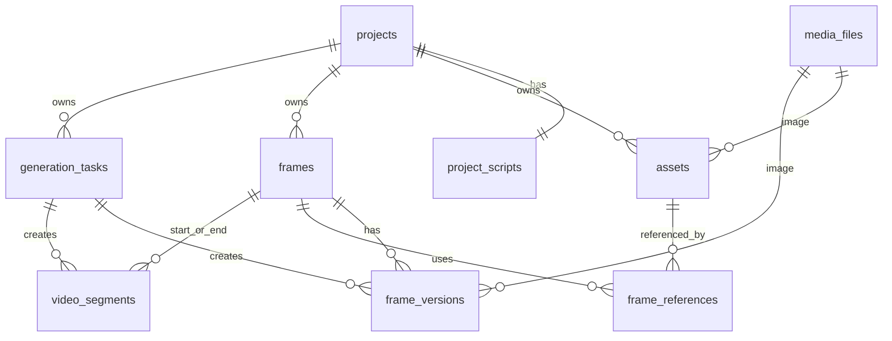

# 表结构设计

这是图片关键帧生成工作台的 MVP 数据模型。设计目标不是把页面上的每个区域都变成一张表，而是围绕创作链路拆分：

项目 -> 剧本 -> 资产 -> 关键帧 -> 帧图片版本 -> 生成任务 -> 后续视频片段

## 设计原则

- 项目只保存项目级配置，比如名称、描述、宽高比。
- 剧本在 MVP 里一个项目只保留一份正文，不做复杂分场表。
- 资产库统一管理角色、场景、道具、其他素材，图片文件独立进媒体表。
- 关键帧记录故事信息和时长，是后续视频节奏的核心表。
- 帧版本记录每次生成出的图片，一帧可以有多个版本，当前选中版本挂在 `frames.selected_version_id`。
- 生成任务统一记录 GPT Image、图片编辑、Seedance 2 等模型调用，方便排队、重试和审计。
- 视频相关先预留最小表，不和图片帧工作台搅在一起。

## ER 关系



## MVP 表

### projects

项目列表和项目设置。

```sql
create table projects (
  id uuid primary key default gen_random_uuid(),
  name text not null,
  description text not null default '',
  aspect_ratio text not null default '16:9',
  status text not null default 'active',
  created_at timestamptz not null default now(),
  updated_at timestamptz not null default now()
);

create index idx_projects_created_at on projects (created_at desc);
```

### project_scripts

一个项目一份剧本文本。先别急着拆“场次/镜头”，现在拆了只会增加录入负担。

```sql
create table project_scripts (
  id uuid primary key default gen_random_uuid(),
  project_id uuid not null unique references projects(id) on delete cascade,
  content text not null default '',
  created_at timestamptz not null default now(),
  updated_at timestamptz not null default now()
);
```

### media_files

统一保存上传图、资产图、帧图、后续视频文件。不要把 base64 存业务表里，业务表只挂文件引用。

```sql
create table media_files (
  id uuid primary key default gen_random_uuid(),
  project_id uuid references projects(id) on delete cascade,
  file_type text not null check (file_type in ('image', 'video', 'audio', 'other')),
  storage_key text not null,
  url text not null,
  mime_type text,
  width int,
  height int,
  duration_ms int,
  size_bytes bigint,
  metadata jsonb not null default '{}'::jsonb,
  created_at timestamptz not null default now()
);

create index idx_media_files_project on media_files (project_id, created_at desc);
```

### assets

资产库：角色、场景、道具、其他。资产可以先没有图片，点“新建资产”后再替换图片。

```sql
create table assets (
  id uuid primary key default gen_random_uuid(),
  project_id uuid not null references projects(id) on delete cascade,
  type text not null check (type in ('role', 'scene', 'prop', 'other')),
  name text not null,
  description text not null default '',
  default_prompt text not null default '',
  tags text[] not null default '{}',
  image_file_id uuid references media_files(id) on delete set null,
  sort_order int not null default 0,
  created_at timestamptz not null default now(),
  updated_at timestamptz not null default now()
);

create index idx_assets_project_type on assets (project_id, type, sort_order, created_at desc);
```

### frames

关键帧时间轴。这里要保存“这一帧讲什么”和“这一帧持续多久”。

```sql
create table frames (
  id uuid primary key default gen_random_uuid(),
  project_id uuid not null references projects(id) on delete cascade,
  order_index int not null,
  summary text not null default '',
  duration_ms int not null default 3000,
  people text not null default '',
  dialogue text not null default '',
  action text not null default '',
  emotion text not null default '',
  note text not null default '',
  current_prompt text not null default '',
  selected_version_id uuid,
  created_at timestamptz not null default now(),
  updated_at timestamptz not null default now(),
  unique (project_id, order_index)
);

create index idx_frames_project_order on frames (project_id, order_index);
```

### frame_versions

一帧可以生成多张图，版本表保存每次结果。不要覆盖旧图，否则用户没法做 v1/v2 切换。

```sql
create table frame_versions (
  id uuid primary key default gen_random_uuid(),
  frame_id uuid not null references frames(id) on delete cascade,
  version_no int not null,
  image_file_id uuid references media_files(id) on delete set null,
  prompt text not null default '',
  model_provider text not null default 'openai',
  model_name text not null default 'gpt-image-2',
  generation_task_id uuid,
  metadata jsonb not null default '{}'::jsonb,
  created_at timestamptz not null default now(),
  unique (frame_id, version_no)
);

create index idx_frame_versions_frame on frame_versions (frame_id, version_no);
```

给 `frames.selected_version_id` 补外键，避免建表时互相依赖：

```sql
alter table frames
  add constraint fk_frames_selected_version
  foreign key (selected_version_id)
  references frame_versions(id)
  on delete set null;
```

### frame_references

记录某一帧生成时引用了哪些资产或项目帧。这个表很重要，否则以后追溯“这张图为什么长这样”会很痛苦。

```sql
create table frame_references (
  id uuid primary key default gen_random_uuid(),
  frame_id uuid not null references frames(id) on delete cascade,
  ref_type text not null check (ref_type in ('asset', 'frame')),
  asset_id uuid references assets(id) on delete cascade,
  ref_frame_id uuid references frames(id) on delete cascade,
  role text not null default 'reference',
  sort_order int not null default 0,
  created_at timestamptz not null default now(),
  check (
    (ref_type = 'asset' and asset_id is not null and ref_frame_id is null)
    or
    (ref_type = 'frame' and ref_frame_id is not null and asset_id is null)
  )
);

create index idx_frame_references_frame on frame_references (frame_id, sort_order);
```

### generation_tasks

统一任务表：文生图、图生图、图片编辑、帧图转视频、文生视频都进这里。

```sql
create table generation_tasks (
  id uuid primary key default gen_random_uuid(),
  project_id uuid not null references projects(id) on delete cascade,
  task_type text not null check (
    task_type in (
      'text_to_image',
      'image_to_image',
      'image_edit',
      'text_to_video',
      'frames_to_video'
    )
  ),
  target_type text not null check (target_type in ('asset', 'frame', 'video_segment', 'project')),
  target_id uuid,
  provider text not null,
  model_name text not null,
  status text not null default 'queued' check (
    status in ('queued', 'running', 'succeeded', 'failed', 'cancelled')
  ),
  prompt text not null default '',
  request_payload jsonb not null default '{}'::jsonb,
  response_payload jsonb not null default '{}'::jsonb,
  error_message text not null default '',
  started_at timestamptz,
  finished_at timestamptz,
  created_at timestamptz not null default now(),
  updated_at timestamptz not null default now()
);

create index idx_generation_tasks_project on generation_tasks (project_id, created_at desc);
create index idx_generation_tasks_status on generation_tasks (status, created_at);
```

把帧版本关联任务：

```sql
alter table frame_versions
  add constraint fk_frame_versions_generation_task
  foreign key (generation_task_id)
  references generation_tasks(id)
  on delete set null;
```

## 视频工作台预留表

### video_segments

后面做 Seedance 2 多帧参考图生视频时，用这个表表示两个关键帧之间的一段视频。

```sql
create table video_segments (
  id uuid primary key default gen_random_uuid(),
  project_id uuid not null references projects(id) on delete cascade,
  order_index int not null,
  start_frame_id uuid not null references frames(id) on delete cascade,
  end_frame_id uuid references frames(id) on delete set null,
  duration_ms int not null default 3000,
  prompt text not null default '',
  video_file_id uuid references media_files(id) on delete set null,
  generation_task_id uuid references generation_tasks(id) on delete set null,
  status text not null default 'draft' check (
    status in ('draft', 'queued', 'running', 'succeeded', 'failed')
  ),
  metadata jsonb not null default '{}'::jsonb,
  created_at timestamptz not null default now(),
  updated_at timestamptz not null default now(),
  unique (project_id, order_index)
);

create index idx_video_segments_project_order on video_segments (project_id, order_index);
```

## 字段映射

| 页面 | 字段 | 表 |
| --- | --- | --- |
| 项目列表 | 项目名、描述、宽高比 | `projects` |
| 剧本 | 剧本文本 | `project_scripts` |
| 资产库 | 名称、类型、描述、默认提示词、标签、图片 | `assets` + `media_files` |
| 关键帧时间轴 | 顺序、时长、当前版本 | `frames` + `frame_versions` |
| 帧详情 | 概要、人物、对白、动作、情绪、备注 | `frames` |
| 底部输入舱 | 当前生成提示词、引用资产/帧 | `frames.current_prompt` + `frame_references` |
| 图片生成结果 | v1/v2/v3 图片版本 | `frame_versions` |
| 模型调用 | GPT Image / Seedance 2 请求与结果 | `generation_tasks` |

## 先不要做的表

- 不要先拆复杂分镜表：现在剧本只有一个正文编辑区。
- 不要单独做角色一致性配置表：当前交互已经明确删掉了这个字段。
- 不要做资产生成日志表：用户已经判断它像操作日志，MVP 不需要。
- 不要把视频工作台和图片关键帧工作台混在一张大表里：后面会变难维护。

## 下一步建议

1. 后端先实现 `projects`、`project_scripts`、`media_files`、`assets`、`frames`、`frame_versions`。
2. 生成模型接入时再启用 `frame_references` 和 `generation_tasks`。
3. Seedance 2 工作台开始做时，再启用 `video_segments`。
